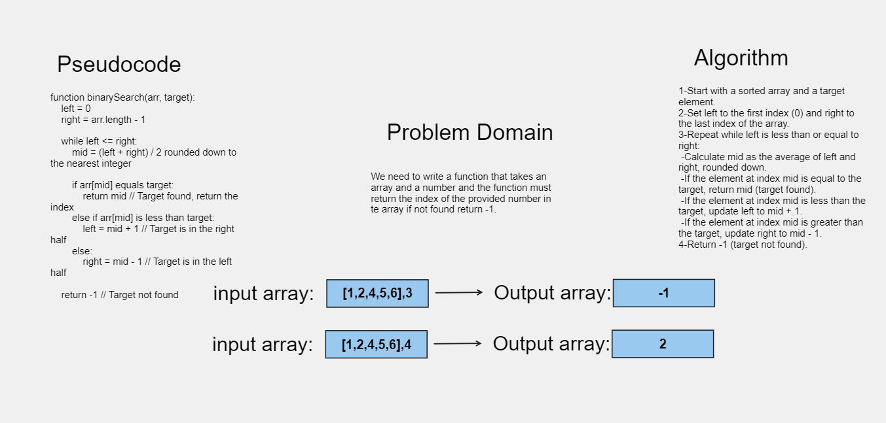

# Array-binary-search

Write a function called BinarySearch which takes in 2 parameters: a sorted array and the search key. Without utilizing any of the built-in methods available to your language, return the index of the array’s element that is equal to the value of the search key, or -1 if the element is not in the array.

## Whiteboard Process

[Whiteboard](https://alqudscollege-my.sharepoint.com/:wb:/g/personal/23037632_student_ltuc_com/EaSXyIenvWdIq6U1WPmawLQB2RrRBVxDgdEeWCoCqfniWw?e=GOzmYV)



## Approach & Efficiency

O notation

## Solution

```javascript
function BinarySearch(arr, num) {
  const left = 0;
  const right = arr.length - 1;
  while (left <= right) {
    const m = Math.floor((left + right) / 2);
    if (arr[m] === num) {
      return m;
    } else if (arr[m] < num) {
      left = m + 1;
    } else {
      right = m - 1;
    }
  }
  return -1;
}
```
