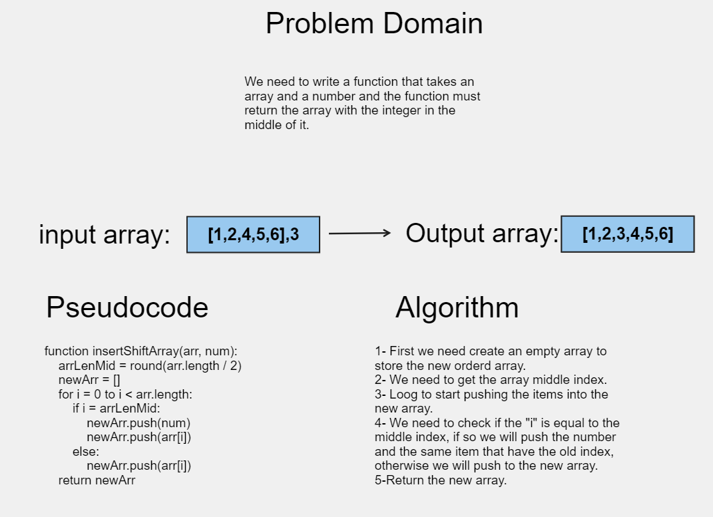

# Array-reverse

We need to write a function that takes an array and a number and the function must return the array with the integer in the middle of it.

## Whiteboard Process

[Whiteboard](https://alqudscollege-my.sharepoint.com/:wb:/g/personal/23037632_student_ltuc_com/EefWS5Wlv8VNjw91n1aDsjYBkNOZG-WyXmGeTkJSCOI5ew?e=B4T3pO)



## Approach & Efficiency

O notation

## Solution

```javascript
function insertShiftArray(arr, num) {
  const arrLenMid = Math.round(arr.length / 2);
  const newArr = [];
  for (let i = 0; i < arr.length; i++) {
    if (i === arrLenMid) {
      newArr.push(num);
      newArr.push(arr[i]);
    } else {
      newArr.push(arr[i]);
    }
  }
  return newArr;
}
```
