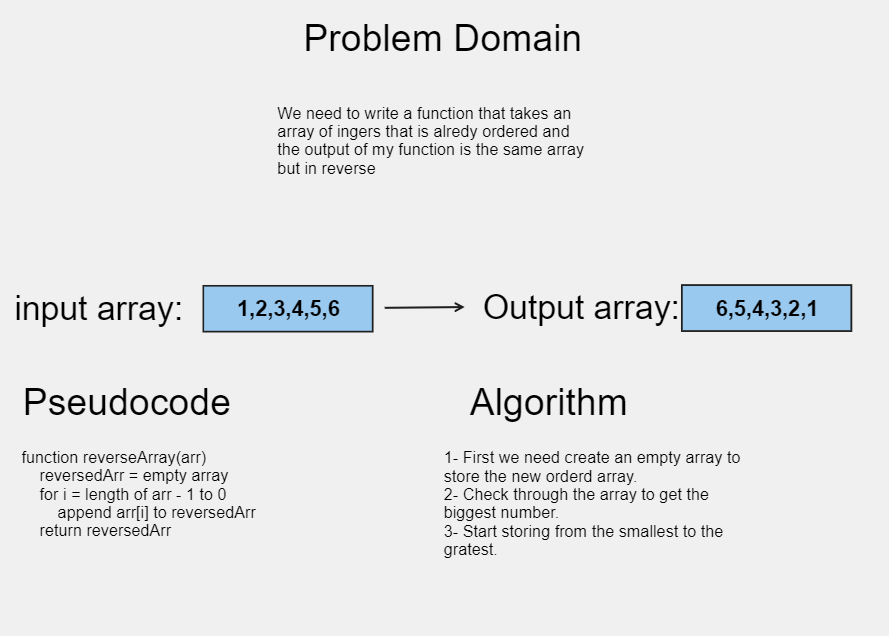

# Array-reverse

Write a function called reverseArray which takes an array as an argument. Without utilizing any of the built-in methods available to your language, return an array with elements in reversed order.

## Whiteboard Process

[Whiteboard](https://alqudscollege-my.sharepoint.com/:wb:/g/personal/23037632_student_ltuc_com/ESXFp0uvw5NKjvfRYTm65cYB6mGAMSjogNsLGooECltetw?e=bRUZGi)



## Approach & Efficiency

O notation

## Solution

```javascript
function reverseArray(arr) {
  var reversedArr = [];
  for (var i = arr.length - 1; i >= 0; i--) {
    reversedArr.push(arr[i]);
  }
  return reversedArr;
}
```
