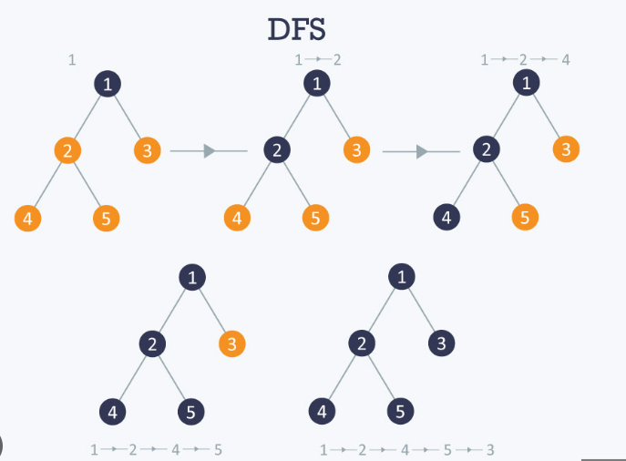

# Implementation: Depth First

## **Whiteboard Process**



## **Solution**

```javascript
"use strict";
depthFirst(node) {
    const visited = new Set();
    const result = [];

    const dfs = (currentNode) => {
      if (!currentNode) return;

      visited.add(currentNode);
      result.push(currentNode);

      const neighbors = this.getNeighbors(currentNode);

      for (const neighborEdge of neighbors) {
        const neighbor = neighborEdge.vertex;
        if (!visited.has(neighbor)) {
          dfs(neighbor);
        }
      }
    };

    dfs(node);
    console.log(result);
    return result;
  }
```
