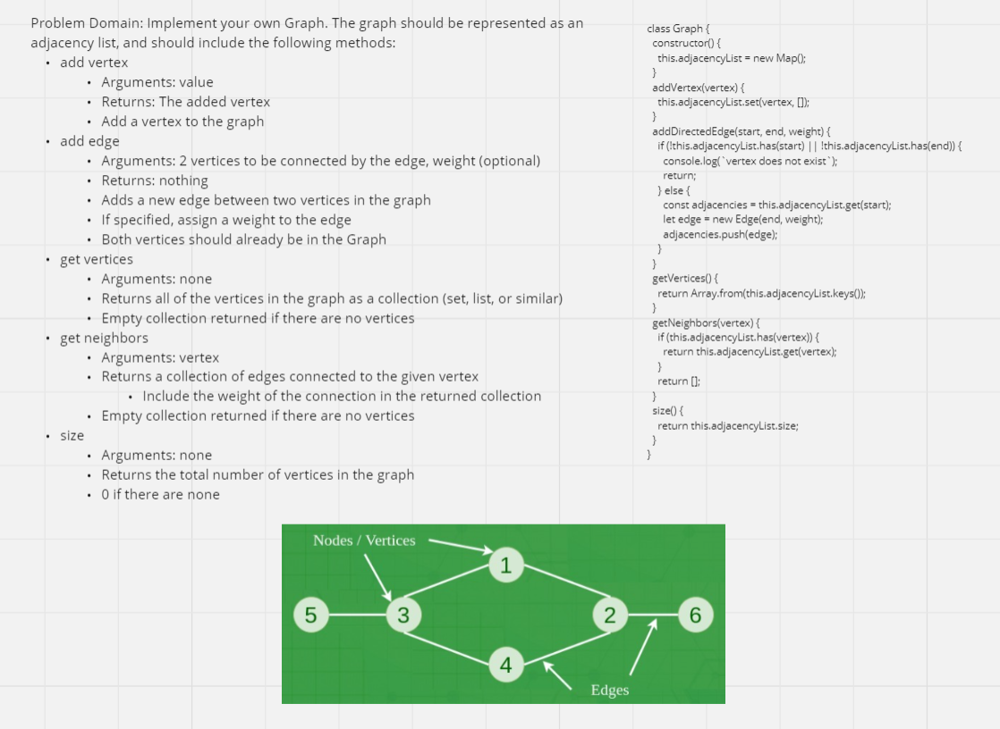

# Implementation: Graph

## **Whiteboard Process**


[Link](https://miro.com/app/board/uXjVMn3zvkA=/?share_link_id=492866872849)

## **Solution**

```javascript
"use strict";
class Graph {
  constructor() {
    this.adjacencyList = new Map();
  }
  addVertex(vertex) {
    this.adjacencyList.set(vertex, []);
  }
  addDirectedEdge(start, end, weight) {
    if (!this.adjacencyList.has(start) || !this.adjacencyList.has(end)) {
      console.log(`vertex does not exist`);
      return;
    } else {
      const adjacencies = this.adjacencyList.get(start);
      let edge = new Edge(end, weight);
      adjacencies.push(edge);
    }
  }
  getVertices() {
    return Array.from(this.adjacencyList.keys());
  }
  getNeighbors(vertex) {
    if (this.adjacencyList.has(vertex)) {
      return this.adjacencyList.get(vertex);
    }
    return [];
  }
  size() {
    return this.adjacencyList.size;
  }
}
```
