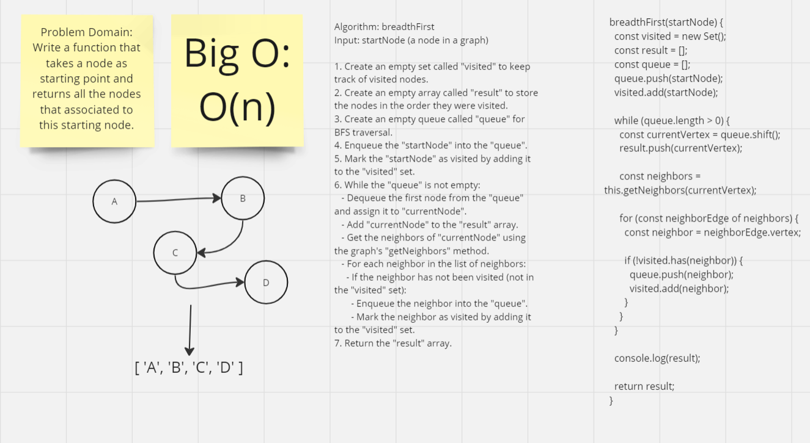

# Implementation: Breadth first

## **Whiteboard Process**


[Link](https://miro.com/app/board/uXjVMm3SOEY=/?share_link_id=827469892259)

## **Solution**

```javascript
"use strict";
  breadthFirst(startNode) {
    const visited = new Set();
    const result = [];
    const queue = [];

    queue.push(startNode);
    visited.add(startNode);

    while (queue.length > 0) {
      const currentVertex = queue.shift();
      result.push(currentVertex);

      const neighbors = this.getNeighbors(currentVertex);

      for (const neighborEdge of neighbors) {
        const neighbor = neighborEdge.vertex;

        if (!visited.has(neighbor)) {
          queue.push(neighbor);
          visited.add(neighbor);
        }
      }
    }

    console.log(result);

    return result;
  }
```
