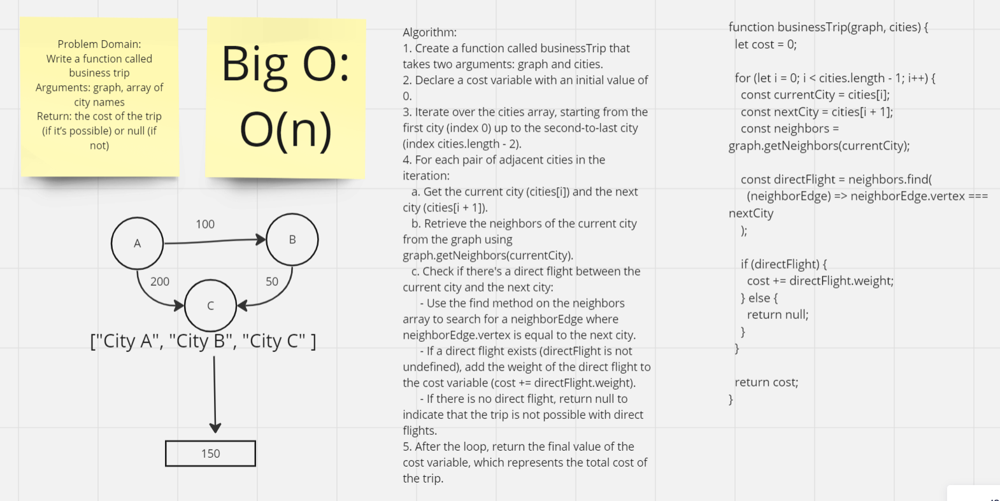

# Implementation: Graph business trip

## **Whiteboard Process**


[Link](https://miro.com/app/board/uXjVMlrp89Q=/?share_link_id=640460414715)

## **Solution**

```javascript
"use strict";
function businessTrip(graph, cities) {
  let cost = 0;

  for (let i = 0; i < cities.length - 1; i++) {
    const currentCity = cities[i];
    const nextCity = cities[i + 1];
    const neighbors = graph.getNeighbors(currentCity);

    const directFlight = neighbors.find(
      (neighborEdge) => neighborEdge.vertex === nextCity
    );

    if (directFlight) {
      cost += directFlight.weight;
    } else {
      return null;
    }
  }

  return cost;
}
```
