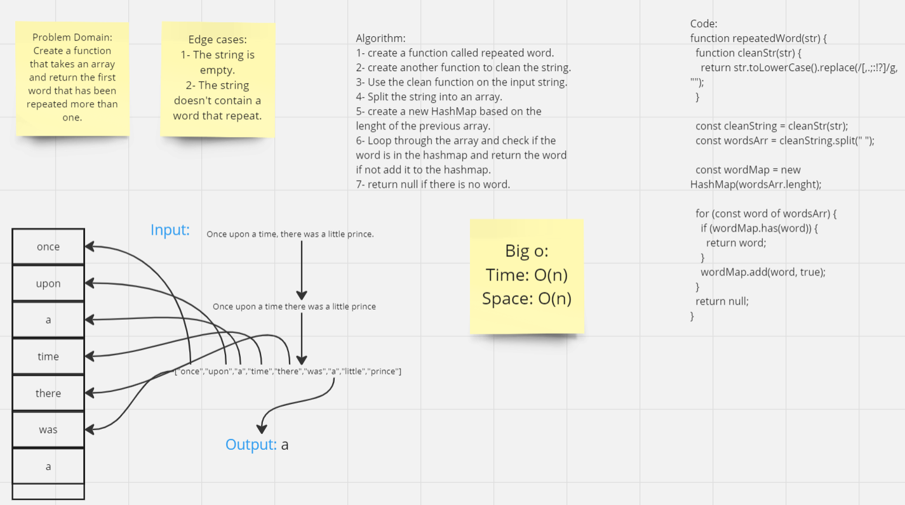

# Implementation: Repeated word

## **Whiteboard Process**


[Link](https://miro.com/app/board/uXjVMqDvEMw=/?share_link_id=19427992342)

## **Solution**

```javascript
"use strict";
function repeatedWord(str) {
  function cleanStr(str) {
    return str.toLowerCase().replace(/[,.;:!?]/g, "");
  }

  const cleanString = cleanStr(str);
  const wordsArr = cleanString.split(" ");

  const wordMap = new HashMap(wordsArr.lenght);

  for (const word of wordsArr) {
    if (wordMap.has(word)) {
      return word;
    }
    wordMap.add(word, true);
  }
  return null;
}
```
