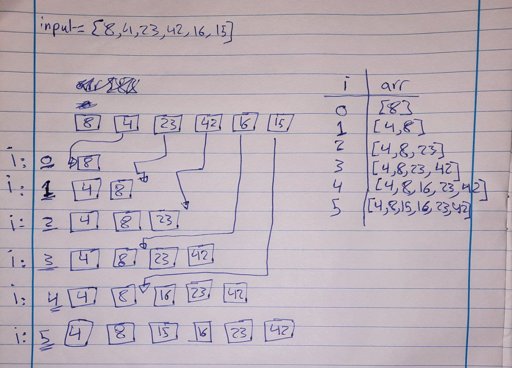

# Implementation: Insertion Sort

## **Whiteboard Process**



## **Solution**

```javascript
"use strict";

function insert(sorted, value) {
  let i = 0;
  while (value > sorted[i]) {
    i++;
  }
  while (i < sorted.length) {
    const temp = sorted[i];
    sorted[i] = value;
    value = temp;
    i++;
  }
  sorted.push(value);
}

function insertionSort(input) {
  const sorted = [input[0]];
  for (let i = 1; i < input.length; i++) {
    insert(sorted, input[i]);
  }
  return sorted;
}
```
