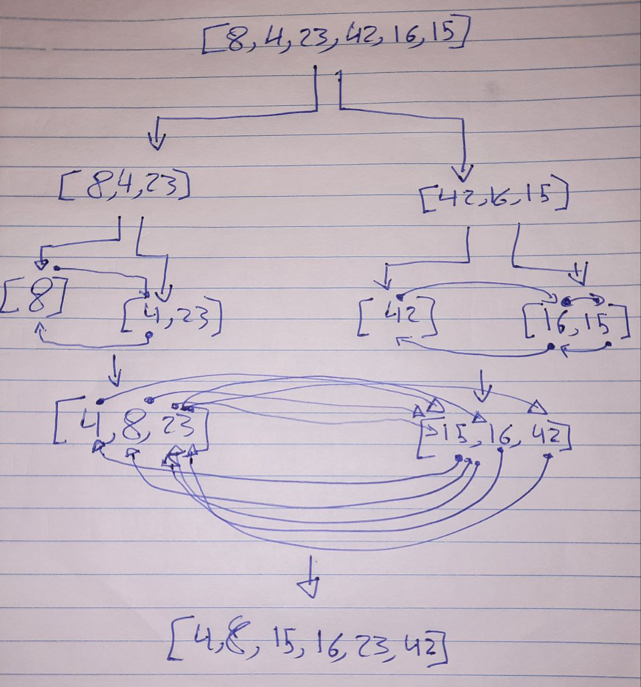

# Implementation: Insertion Sort

## **Whiteboard Process**



## **Solution**

```javascript
function mergeSort(arr) {
  const n = arr.length;

  if (n > 1) {
    const mid = Math.floor(n / 2);
    const left = arr.slice(0, mid);
    const right = arr.slice(mid);

    mergeSort(left);
    mergeSort(right);

    merge(left, right, arr);
  }
}

function merge(left, right, arr) {
  let i = 0;
  let j = 0;
  let k = 0;

  while (i < left.length && j < right.length) {
    if (left[i] <= right[j]) {
      arr[k] = left[i];
      i++;
    } else {
      arr[k] = right[j];
      j++;
    }
    k++;
  }

  while (i < left.length) {
    arr[k] = left[i];
    i++;
    k++;
  }

  while (j < right.length) {
    arr[k] = right[j];
    j++;
    k++;
  }
}

module.exports = mergeSort;
```
