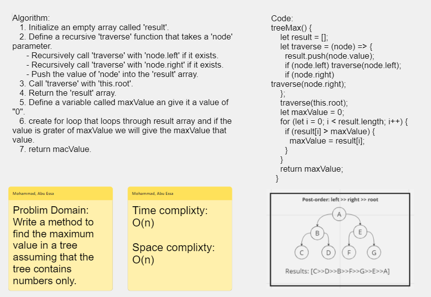

# Challenge Title : Tree Max

# Whiteboard Process

### Binary Tree

[Whiteboard Link](https://alqudscollege-my.sharepoint.com/:wb:/g/personal/23037632_student_ltuc_com/EU_kcDXbA2lPp1Hr--VTZ6ABa_Y37BrDG0-SQOqnkpk6CQ?e=fYeHuz)



---

# Solution

```javascript
 treeMax() {
    let result = [];
    let traverse = (node) => {
      result.push(node.value);
      if (node.left) traverse(node.left);
      if (node.right) traverse(node.right);
    };
    traverse(this.root);
    let maxValue = 0;
    for (let i = 0; i < result.length; i++) {
      if (result[i] > maxValue) {
        maxValue = result[i];
      }
    }
    return maxValue;
  }
```
