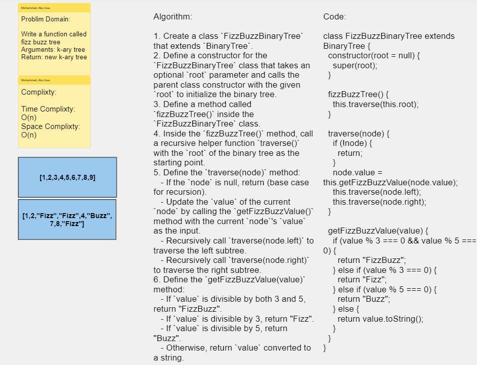

# Challenge Title : FizzBuzz

# Whiteboard Process

### Binary Tree

[Whiteboard Link](https://alqudscollege-my.sharepoint.com/:wb:/g/personal/23037632_student_ltuc_com/Efs8BFdD7I1HrSomukKMgOMBPiieF5zvNkdwja32tiJRzg?e=fxV2xS)



---

# Solution

```javascript
"use strict";
// FizzBuzzBinaryTree.js
const BinaryTree = require("./BinaryTree");

class FizzBuzzBinaryTree extends BinaryTree {
  constructor(root = null) {
    super(root);
  }

  fizzBuzzTree() {
    this.traverse(this.root);
  }

  traverse(node) {
    if (!node) {
      return;
    }
    node.value = this.getFizzBuzzValue(node.value);
    this.traverse(node.left);
    this.traverse(node.right);
  }

  getFizzBuzzValue(value) {
    if (value % 3 === 0 && value % 5 === 0) {
      return "FizzBuzz";
    } else if (value % 3 === 0) {
      return "Fizz";
    } else if (value % 5 === 0) {
      return "Buzz";
    } else {
      return value.toString();
    }
  }
}

module.exports = FizzBuzzBinaryTree;
```

---
