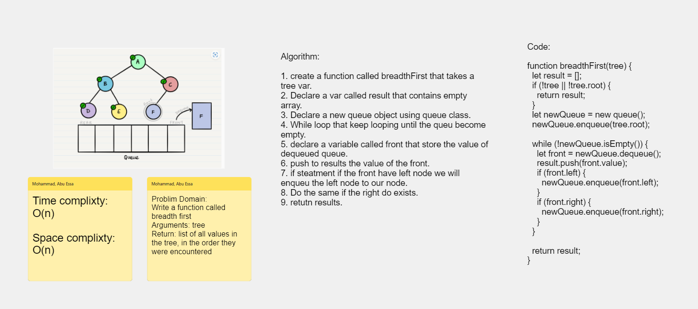

# Challenge Title : Breadth First

# Whiteboard Process

### Binary Tree

[Whiteboard Link](https://alqudscollege-my.sharepoint.com/:wb:/g/personal/23037632_student_ltuc_com/ERgdzeHUd3JHtMQdJfyiiucB_A3cz2n99ypbD4m0o8OjCw?e=wNFCkn)



---

# Solution

```javascript
function breadthFirst(tree) {
  let result = [];
  if (!tree || !tree.root) {
    return result;
  }
  let newQueue = new queue();
  newQueue.enqueue(tree.root);

  while (!newQueue.isEmpty()) {
    let front = newQueue.dequeue();
    result.push(front.value);
    if (front.left) {
      newQueue.enqueue(front.left);
    }
    if (front.right) {
      newQueue.enqueue(front.right);
    }
  }

  return result;
}
```
