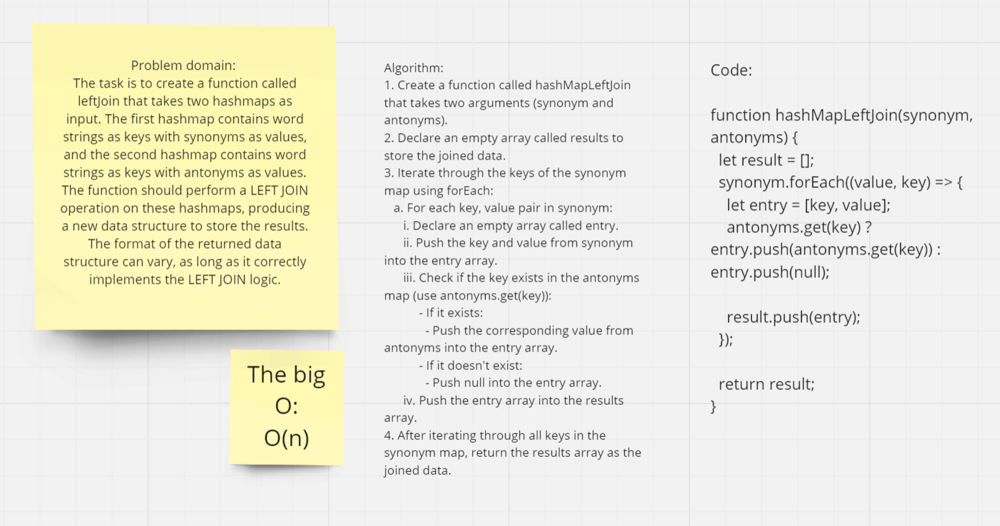

# Implement a simplified LEFT JOIN for 2 Hashmaps.

## **Whiteboard Process**


[Link](https://miro.com/app/board/uXjVMoK9WDI=/?share_link_id=381868598958)

## **Solution**

```javascript
"use strict";
function hashMapLeftJoin(synonym, antonyms) {
  let result = [];

  synonym.forEach((value, key) => {
    let entry = [key, value];
    antonyms.get(key) ? entry.push(antonyms.get(key)) : entry.push(null);

    result.push(entry);
  });

  return result;
}
```
