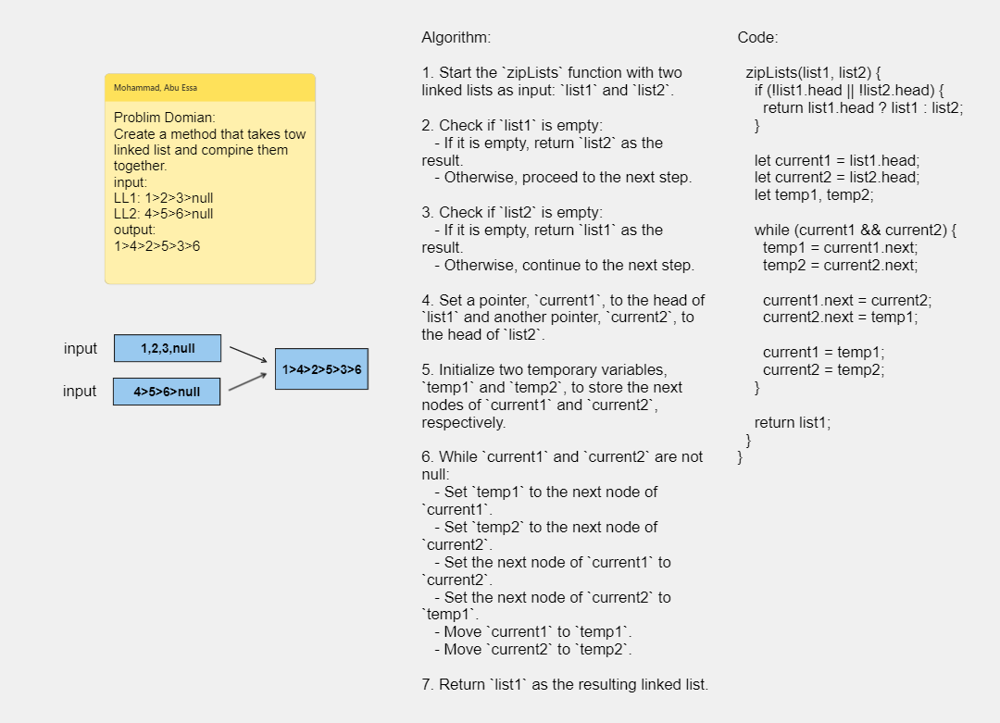

# Implementation: Append & Insert Before & Insert After

## **Whiteboard Process**



[White Board Link](https://alqudscollege-my.sharepoint.com/:wb:/g/personal/23037632_student_ltuc_com/EdHwMHsWSOxNtBDYt8yiIS4BP0Rg3B7MmUTlLhrS3eT7hQ?e=Ttgdsu)

## **Approach & Efficiency**

## **Solution**

### Node Class Code :

```javascript
"use strict";
class Node {
  constructor(value) {
    this.value = value;
    this.next = null;
  }
}
module.exports = Node;
```

### LinkedList Class Code :

```javascript
"use strict";
const Node = require("./Node.js");
class LinkedList {
  constructor() {
    this.head = null;
  }
  zipLists(list1, list2) {
    if (!list1.head || !list2.head) {
      return list1.head ? list1 : list2;
    }

    let current1 = list1.head;
    let current2 = list2.head;
    let temp1, temp2;

    while (current1 && current2) {
      temp1 = current1.next;
      temp2 = current2.next;

      current1.next = current2;
      current2.next = temp1;

      current1 = temp1;
      current2 = temp2;
    }

    return list1;
  }
}
module.exports = LinkedList;
```
