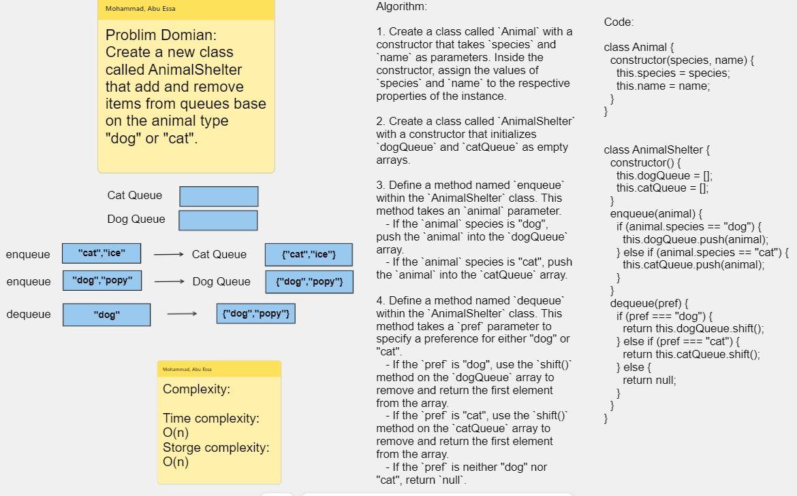

# Challenge Title : Pseudo Queue Implementation

# Whiteboard Process

### Pseudo Queue Whiteboard

[Whiteboard Link](https://alqudscollege-my.sharepoint.com/:wb:/g/personal/23037632_student_ltuc_com/EQ-1YHdjBCRFnFVrFxjbPl0Bv1sj7CkHAGVhYly4oowBQA?e=aSVEe1)



---

# Solution

```javascript
"use strict";

class Animal {
  constructor(species, name) {
    this.species = species;
    this.name = name;
  }
}

class AnimalShelter {
  constructor() {
    this.dogQueue = [];
    this.catQueue = [];
  }
  enqueue(animal) {
    if (animal.species == "dog") {
      this.dogQueue.push(animal);
    } else if (animal.species == "cat") {
      this.catQueue.push(animal);
    }
  }
  dequeue(pref) {
    if (pref === "dog") {
      return this.dogQueue.shift();
    } else if (pref === "cat") {
      return this.catQueue.shift();
    } else {
      return null;
    }
  }
}
```

## Tests

```javascript
// Test code

let dog1 = new Animal("dog", "popy");
let dog2 = new Animal("dog", "pit");

let cat1 = new Animal("cat", "ice");
let cat2 = new Animal("cat", "orio");

let shelter = new AnimalShelter();

shelter.enqueue(dog1);
shelter.enqueue(cat1);
shelter.enqueue(dog2);
shelter.enqueue(cat2);

console.log(shelter.dequeue("dog")); // Animal { species: 'dog', name: 'popy' }
console.log(shelter.dequeue("dog")); // Animal { species: 'dog', name: 'pit' }

console.log(shelter.dequeue("cat")); // Animal { species: 'cat', name: 'ice' }
console.log(shelter.dequeue("cat")); // Animal { species: 'cat', name: 'orio' }

console.log(shelter.dequeue("cat")); // null
```
