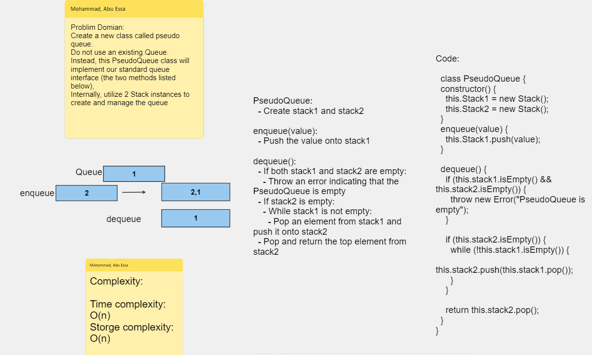

# Challenge Title : Pseudo Queue Implementation

# Whiteboard Process

### Pseudo Queue Whiteboard

[Whiteboard Link](https://alqudscollege-my.sharepoint.com/:wb:/g/personal/23037632_student_ltuc_com/EX51leQhn2NKlLbYR4k2YIwBIuScktpILDg7qCpKBGsXEA?e=rqdZii)



---

# Solution

```javascript
"use strict";

const Node = require("./Node.js");

class PseudoQueue {
  constructor() {
    this.Stack1 = new Stack();
    this.Stack2 = new Stack();
  }
  enqueue(value) {
    this.Stack1.push(value);
  }

  dequeue() {
    if (this.stack1.isEmpty() && this.stack2.isEmpty()) {
      throw new Error("Empty");
    }

    if (this.stack2.isEmpty()) {
      while (!this.stack1.isEmpty()) {
        this.stack2.push(this.stack1.pop());
      }
    }

    return this.stack2.pop();
  }
}
```

## Tests

```javascript
const pseudoQueue = new PseudoQueue();

// Enqueue values
pseudoQueue.enqueue(10);
pseudoQueue.enqueue(20);
pseudoQueue.enqueue(30);

// Dequeue values
console.log(pseudoQueue.dequeue());
console.log(pseudoQueue.dequeue());

// Enqueue more values
pseudoQueue.enqueue(40);
pseudoQueue.enqueue(50);

// Dequeue remaining values
console.log(pseudoQueue.dequeue());
console.log(pseudoQueue.dequeue());
console.log(pseudoQueue.dequeue());

// Trying to dequeue from an empty queue
console.log(pseudoQueue.dequeue()); // Output: null
```
