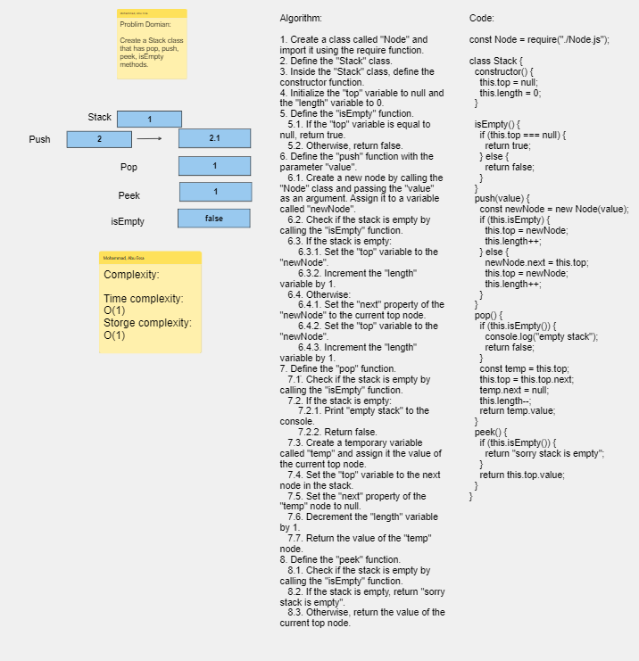
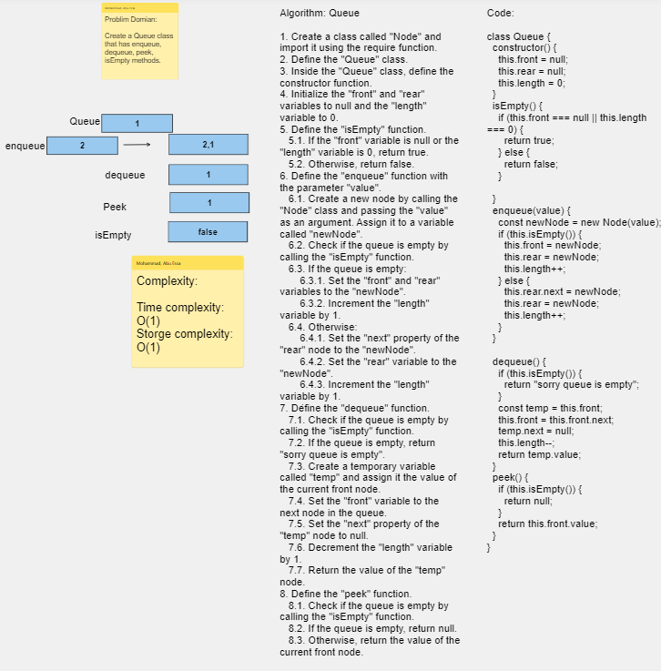

# Challenge Title : Stack and a Queue Implementation

# Whiteboard Process

### Stack Whiteboard

[Whiteboard Link](https://alqudscollege-my.sharepoint.com/:wb:/g/personal/23037632_student_ltuc_com/EfKvvFE_YlFMnGn79QBalGkBKIa-6X3mi2VrM1rt80XZUQ?e=CYNpMj)


---

### Queue Whiteboard

[Whiteboard Link](https://alqudscollege-my.sharepoint.com/:wb:/g/personal/23037632_student_ltuc_com/EWtu3G07gKVDt-ihcbGeULwBVjJv0SOOMMXfnFk7iNmCMw?e=IShu5F)


---

# Solution

## Stack

```javascript
"use strict";

const Node = require("./Node.js");

class Stack {
  constructor() {
    this.top = null;
    this.length = 0;
  }

  isEmpty() {
    if (this.top === null) {
      return true;
    } else {
      return false;
    }
  }
  push(value) {
    const newNode = new Node(value);
    if (this.isEmpty) {
      this.top = newNode;
      this.length++;
    } else {
      newNode.next = this.top;
      this.top = newNode;
      this.length++;
    }
  }
  pop() {
    if (this.isEmpty()) {
      console.log("empty stack");
      return false;
    }
    const temp = this.top;
    this.top = this.top.next;
    temp.next = null;
    this.length--;
    return temp.value;
  }
  peek() {
    if (this.isEmpty()) {
      return "sorry stack is empty";
    }
    return this.top.value;
  }
}

module.exports = Stack;
```

## Queue

```javascript
const Node = require("./Node.js");

class Queue {
  constructor() {
    this.front = null;
    this.rear = null;
    this.length = 0;
  }
  isEmpty() {
    if (this.front === null || this.length === 0) {
      return true;
    } else {
      return false;
    }
  }
  enqueue(value) {
    const newNode = new Node(value);
    if (this.isEmpty()) {
      this.front = newNode;
      this.rear = newNode;
      this.length++;
    } else {
      this.rear.next = newNode;
      this.rear = newNode;
      this.length++;
    }
  }

  dequeue() {
    if (this.isEmpty()) {
      return "sorry queue is empty";
    }
    const temp = this.front;
    this.front = this.front.next;
    temp.next = null;
    this.length--;
    return temp.value;
  }
  peek() {
    if (this.isEmpty()) {
      return null;
    }
    return this.front.value;
  }
}
module.exports = Queue;
```

## Tests

```javascript
"use strict";
const Stack = require("./Stack");
const Queue = require("./Queue");

let newStack = new Stack();

// Can successfully push onto a stack
newStack.push("10");

//Can successfully push multiple values onto a stack

newStack.push("20");
newStack.push("30");
newStack.push("40");

//Can successfully pop off the stack

newStack.pop();

//Can successfully empty a stack after multiple pops

newStack.pop();
newStack.pop();
newStack.pop();

//Can successfully peek the next item on the stack

newStack.push("40");
newStack.peek();

//Can successfully instantiate an empty stack

newStack.isEmpty();

//Calling pop or peek on empty stack raises exception

newStack.pop();
newStack.pop();

//__________________

let newQueue = new Queue();

// Can successfully enqueue into a queue

newQueue.enqueue("10");

// Can successfully enqueue multiple values into a queue

newQueue.enqueue("20");
newQueue.enqueue("30");

// Can successfully dequeue out of a queue the expected value

newQueue.dequeue();

// Can successfully peek into a queue, seeing the expected value

newQueue.peek();

// Can successfully empty a queue after multiple dequeues

newQueue.dequeue();
newQueue.dequeue();

// Can successfully instantiate an empty queue

newQueue.isEmpty();

// Calling dequeue or peek on empty queue raises exception

newQueue.dequeue();
```
