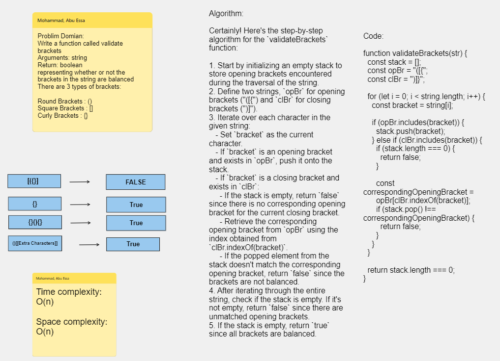

# Challenge Title : Stack-queue-brackets

# Whiteboard Process

[Whiteboard Link](https://alqudscollege-my.sharepoint.com/:wb:/g/personal/23037632_student_ltuc_com/ETKuQhA5BolOldCbYV_kGH0BYpVAsKKrzeWsYHfSMtxmnA?e=kb4u8b)


---

# Solution

```javascript
function validateBrackets(str) {
  const stack = [];
  const opBr = "([{";
  const clBr = ")]}";

  for (let i = 0; i < string.length; i++) {
    const bracket = string[i];

    if (opBr.includes(bracket)) {
      stack.push(bracket);
    } else if (clBr.includes(bracket)) {
      if (stack.length === 0) {
        return false;
      }

      const correspondingOpeningBracket = opBr[clBr.indexOf(bracket)];
      if (stack.pop() !== correspondingOpeningBracket) {
        return false;
      }
    }
  }

  return stack.length === 0;
}
```

## Tests

```javascript
console.log(validateBrackets("{}")); // Output: true
console.log(validateBrackets("{}(){}")); // Output: true
console.log(validateBrackets("()[[Extra Characters]]")); // Output: true
console.log(validateBrackets("(){}[[]]")); // Output: true
console.log(validateBrackets("{}{Code}[Fellows](())")); // Output: true
console.log(validateBrackets("[({}]")); // Output: false
console.log(validateBrackets("(](")); // Output: false
console.log(validateBrackets("{(})")); // Output: false
```
