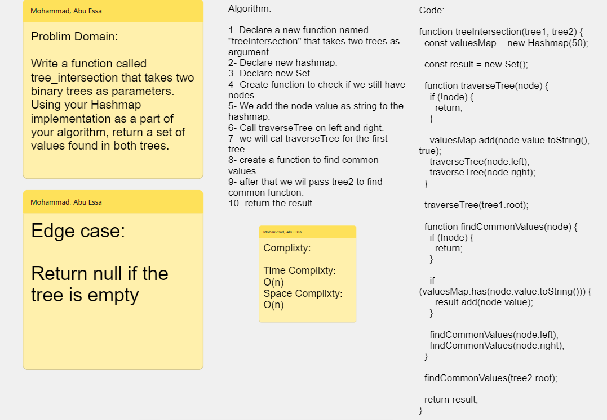

# Implementation: Tree-intersection

## **Whiteboard Process**



## **Solution**

```javascript
"use strict";

function treeIntersection(tree1, tree2) {
  const valuesMap = new Hashmap(50);
  const result = new Set();

  function traverseTree(node) {
    if (!node) {
      return;
    }

    valuesMap.add(node.value.toString(), true);
    traverseTree(node.left);
    traverseTree(node.right);
  }

  traverseTree(tree1.root);

  function findCommonValues(node) {
    if (!node) {
      return;
    }

    if (valuesMap.has(node.value.toString())) {
      result.add(node.value);
    }

    findCommonValues(node.left);
    findCommonValues(node.right);
  }

  findCommonValues(tree2.root);

  return result;
}
```
